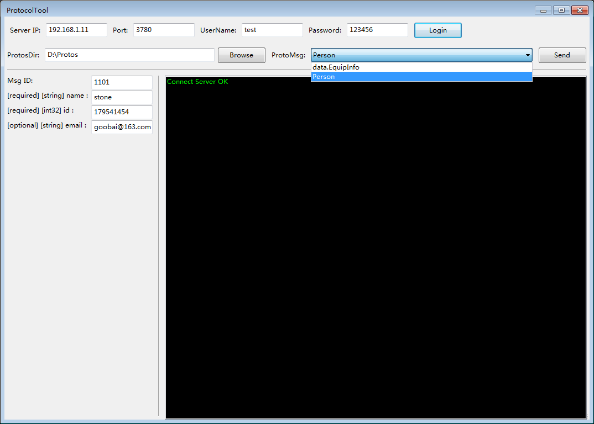

##ProtocolTool是什么?
一个开源的协议调试工具，对于使用 Google Protocol buffers 协议进行交互的客户端和服务器，提供一种通用的工具，模拟协议收发。
ProtocolTool可以动态的加载 .proto文件，而无需重新编译。

##ProtocolTool的工作原理是

ProtocolTool利用了ProtoBuf的动态协议解析功能，根据 type name 创建具体类型的 Message 对象，也就是所谓的Reflection。
有相关的资料可以参考 [Google Protocol Buffer 的使用和原理](http://www.ibm.com/developerworks/cn/linux/l-cn-gpb/)


##编译说明

1、wxWidgets

工具的UI使用了开源的跨平台UI库 [wxWidgets](http://www.wxWidgets.org),您可以下载库的源文件，
解压后用VS打开wxWidgets-3.0.2\build\msw\wx_vc12.sln,直接编译就可以了。因为在工程中用到了环境变量，需要在环境变量中加入
```c
WXMSW = D:\Dev\wxWidgets-3.0.x
```

2、libevent

下载[libevent](http://www.libevent.org/),解压，在vs控制台下
```cplusplus
nmake -f Makefile.nmake
```

3、Google Protocol buffers
在源代码中已经有了，不需要重新下载。


##特别说明
因为这只是个项目开发中的工具，每个人的需求是不一样的，所以工程中只有Debug的工程配置，如有需要，请自行配置Release。
目前仅有windows版本的。


##有问题反馈
在使用中有任何问题，欢迎反馈给我，可以用以下联系方式跟我交流

* [邮件](goobai@163.com) goobai@163.com


##感激
感谢以下的项目,排名不分先后

* [NoahGameFrame](https://github.com/ketoo/NoahGameFrame)
* 
* 
##关于作者

```cplusplus
 A coder.
```
